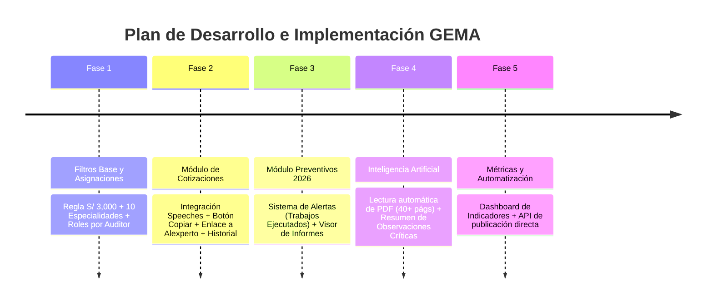

# 📌 Resumen de Requisitos y Plan de Desarrollo - Proyecto GEMA

Este documento consolida todos los requisitos, reglas de negocio y el plan de implementación extraídos directamente de la transcripción de la reunión.

---

## 🎯 Objetivo General
Desarrollar y optimizar el sistema **GEMA** para automatizar, filtrar y acelerar la auditoría de cotizaciones y la revisión de informes técnicos de mantenimientos preventivos/correctivos integrados con **Alexperto**.

---

## 🔑 Requisitos y Reglas de Negocio Extraídas

### 1. Gestión de Accesos y Asignación de Inmuebles
* **Filtrado por Auditor**: A diferencia de *Alxperto* (donde se ven todos los inmuebles), en GEMA cada auditor (ej. Rafael, Cristian) visualizará **únicamente los edificios asignados**.
* **Rol Super-Admin**: Un perfil administrador (ej. Paul) tendrá acceso a la totalidad de edificios y funciones de gestión interna.

### 2. Filtros de Datos (Criterios de Entrada)
* **Filtrado de Especialidades**: Mostrar únicamente las **10 especialidades clave** seleccionadas por el equipo.
* **Filtro Económico**: Procesar únicamente registros cuyo importe sea **superior a S/ 3,000**.

---

### 3. Módulo 1: Gestión de Cotizaciones (Correctivos / SEO)
* **Estados del Flujo**:
  - `Pendiente de revisión` (Registros activos sobre los que el auditor debe trabajar).
  - `Revisado` / `Culminado`.
  - `Observado`.
* **Carga de Datos**:
  - Jalar pendientes actuales + registros cerrados/asignados (para generar **indicadores y métricas**, ej. especialidades más consultadas).
* **Funcionalidades UX**:
  - **Speeches Automatizados**: Generación de textos predefinidos según el estado del trámite.
  - **Botón de Copiar y Enlace Directo**: Enlace inteligente que abre la ficha exacta en *Alexperto* + botón de un clic para copiar el speech.
  - **Botón de "Culminado"**: El auditor marca el ítem cuando ya pegó la nota en *Alexperto*, pasando el pendiente a historial.
  - *Fase 2*: Solicitar accesos de edición/API con el equipo de TI (Joel) para automatizar la publicación directa sin copiar-pegar manual.

---

### 4. Módulo 2: Mantenimientos Preventivos e Informes Técnicos (Año 2026)
* **Alcance de Datos**: Filtrar únicamente información del año **2026** y trabajos **preventivos**.
* **Sistema de Alertas Automáticas**:
  - Notificar al auditor cuando un trabajo pase a estado **Ejecutado**.
* **Lógica de Documentación**:
  - **Caso A (Sin Documentos)**: Si el trabajo está ejecutado pero falta el informe, GEMA sugiere el *speech* de reclamo para el administrador del edificio.
  - **Caso B (Con Informe Técnico cargado)**:
    - **Lectura Inteligente con IA**: Analizar los PDF de informes técnicos (generalmente de 40+ páginas).
    - **Extracción de Observaciones**: Clasificar y resumir automáticamente observaciones **críticas** vs **leves**.
    - **Resumen Ejecutivo**: Mostrar la síntesis en GEMA (ej. *"Se detectaron 15 observaciones críticas..."*) y sugerir el speech de solicitud de cotización de levantamiento.
* **Optimización de Documentos**: Priorizar la carga del campo **Informes Técnicos** (frente a protocolos o certificados) para acelerar el rendimiento de la plataforma.

---

## 🗓️ Plan de Acción y Pasos Sugeridos

### Pasos Inmediatos para Alejandro:
1. **Paso 1**: Confirmar la lista final de las **10 especialidades** y la tabla de asignación de edificios por auditor.
2. **Paso 2**: Implementar la lógica de filtrado inicial (`Monto > S/ 3,000`, año `2026`, `10 especialidades`).
3. **Paso 3**: Crear la interfaz con los botones de **Copiar Speech** y enlace rápido a *Alexperto*.
4. **Paso 4**: Integrar la función de lectura de PDFs con IA para el resumen de informes técnicos.
