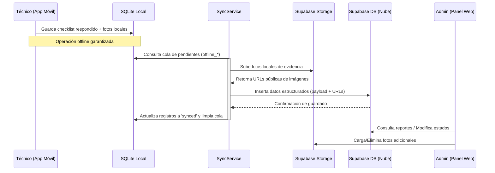

# Informe Técnico y Funcional del Sistema GEMA

Este documento presenta una descripción exhaustiva y detallada de todas las funcionalidades, requisitos, arquitectura técnica y flujos de trabajo desarrollados para el sistema de checklists y gestión de mantenimiento de equipos en edificios, compuesto por una **aplicación móvil offline-first (React Native + Expo)** y un **panel de administración web (Next.js)**.

---

## 1. Introducción y Propósito del Sistema

El sistema GEMA está diseñado para digitalizar, controlar y auditar el mantenimiento de equipos críticos (climatización, electricidad, sistemas contra incendios, etc.) en inmuebles gestionados por empresas operadoras en el mercado peruano. 

El núcleo funcional permite que los técnicos y auditores en campo realicen inspecciones detalladas, checklists y configuraciones técnicas complejas sin depender de una conexión estable a Internet, asegurando la integridad de la información y la posterior sincronización bidireccional en tiempo real con un servidor central backend montado sobre **Supabase**.

---

## 2. Tecnologías Utilizadas

El sistema está construido sobre una infraestructura tecnológica moderna y dividida en tres componentes principales:

### A. Aplicativo Móvil (Frontend Mobile)
* **Framework Principal:** Expo SDK 54, React 19.1 y React Native 0.81.
* **Navegación:** Expo Router v6 (enrutamiento dinámico basado en archivos).
* **Manejo de Estado de Red y Servidor:** TanStack React Query v5 (para caching y sincronización en background).
* **Base de Datos Local:** `expo-sqlite` v16.0 (persistencia de tablas espejo y colas de trabajo offline en modo WAL) y `@react-native-async-storage/async-storage` para persistencia de borradores y tokens.
* **Validación de Formularios:** `react-hook-form` v7 y esquemas de validación con `zod` v4.
* **Monitoreo de Crash y Errores:** `@sentry/react-native` v8.0 para telemetría de errores en runtime.
* **Generación de Reportes PDF:** `expo-print` (conversión de HTML premium a PDF) y `expo-sharing` (compartir reportes generados a nivel nativo de sistema operativo).
* **Captura de Evidencia:** `expo-camera` y `expo-image-picker` para registro de fotos desde la cámara e inventarios.

### B. Consola de Administración (Frontend Web)
* **Framework Principal:** Next.js v16.2.
* **Maquetación y Estilos:** Tailwind CSS v4 con PostCSS v4 para un diseño premium y responsive.
* **Librerías Adicionales:** `react-qr-code` (generación masiva de códigos QR listos para impresión) y `lucide-react` para iconografía.

### C. Backend e Infraestructura Remota (Backend & Database)
* **Proveedor Cloud:** Supabase (PostgreSQL relacional con soporte nativo de JSONB).
* **Servicios Utilizados de Supabase:**
  * **Database:** Base de datos relacional con Row Level Security (RLS) y disparadores automatizados para control horario e integridad.
  * **Auth:** Sistema de autenticación JWT y correos transaccionales para registro y recuperación de contraseña.
  * **Storage:** Bucket para almacenar imágenes de evidencias de mantenimiento, auditorías y firmas digitalizadas.
* **Cliente de Conectividad REST:** Axios v1.12 para el consumo de APIs externas con interceptores para deslogueo automático en caso de expiración de sesión (error 401).

---

## 3. Arquitectura General y Sincronización (Offline-First)

La arquitectura offline-first es el pilar central del aplicativo móvil, asegurando que la operación en sótanos, salas de máquinas o azoteas sin cobertura celular no interrumpa el trabajo técnico.

### Móvil: Base de Datos Local y Colas de Escritura
El dispositivo móvil corre una base de datos local SQLite utilizando `expo-sqlite`, configurada en modo **WAL (Write-Ahead Logging)** para optimizar la velocidad de transacciones concurrentes. El esquema consta de dos tipos de tablas:

1. **Tablas Espejo (Mirror Tables - Prefijo `local_`):** Copias locales de solo lectura sincronizadas desde la nube que contienen el catálogo de inmuebles, equipos, preguntas, programaciones de mantenimiento e instrumentos.
2. **Tablas de Trabajo y Cola Offline (Prefijo `offline_`):** Almacenan los registros generados por el usuario en campo (respuestas de checklists, fotos tomadas, configuraciones de tableros eléctricos, auditorías completadas) antes de ser enviadas a Supabase.

### Motor de Sincronización (`services/sync.ts`)
El servicio [sync.ts](file:///c:/Users/Alejandro/Desktop/GT-CheckList-App/services/sync.ts) realiza la orquestación periódica del flujo de datos en segundo plano mediante las siguientes reglas:
* **Frecuencia de Polling:** Escaneo automático cada 15 segundos combinado con detección inmediata de cambio de estado de red vía `@react-native-community/netinfo`.
* **Mecanismo de Bloqueo Único:** Implementación de semáforos/locks para garantizar que no se ejecuten procesos de sincronización duplicados de forma concurrente, evitando corrupciones o bloqueos de SQLite.
* **Flujo Push (Subida):** Consume la cola de tablas `offline_`, sube los archivos de imágenes asociados a Supabase Storage, inserta los datos estructurados en la base de datos central y actualiza el estado local a `synced`.
* **Flujo Pull (Descarga):** Consulta cambios en el backend remoto y refresca las tablas locales espejo de forma selectiva para minimizar el consumo de datos móviles.

### Gestión de Reintentos Exponenciales (`services/sync-queue.ts`)
En caso de fallos de red persistentes o errores temporales del servidor, el archivo [sync-queue.ts](file:///c:/Users/Alejandro/Desktop/GT-CheckList-App/services/sync-queue.ts) maneja una cola de reintentos estructurada con retroceso exponencial (backoff). La secuencia de reintentos está parametrizada en intervalos crecientes: **10s ➔ 30s ➔ 60s ➔ 2 minutos**, previniendo la saturación del cliente y del servidor.

---

## 4. Requisitos del Sistema

### Requisitos Funcionales
* **RF-01 Autenticación Gated por Rol:** Control de acceso en móvil y web según jerarquía de roles: `TECNICO`, `AUDITOR`, `SUPERVISOR`, `SUPERADMIN`.
* **RF-02 Operación Sin Conexión:** Registro completo de checklists, fotos y configuraciones técnicas en zonas sin internet.
* **RF-03 Registro de Equipos con Campos Técnicos Dinámicos:** Capturar datos técnicos específicos para 12 tipos distintos de equipos del catálogo.
* **RF-04 Ejecución Estructurada de Mantenimiento (Sesiones):** Validación de EPP (Equipos de Protección Personal) mediante capturas de fotos pre y post ejecución.
* **RF-05 Asistente Técnico para Tableros Eléctricos:** Configuración interactiva en campo de interruptores termomagnéticos (ITMs), interruptores generales (ITGs) y diferenciales.
* **RF-06 Auditorías de Edificios:** Flujo de calificación de inmuebles con registro obligatorio de comentarios y fotos en caso de observaciones.
* **RF-07 Generación de Reportes PDF:** Creación local en el dispositivo móvil de Certificados de Operabilidad y Protocolos de Mantenimiento exportables.
* **RF-08 Generación Masiva de Códigos QR:** Emisión y descarga en lote de etiquetas QR para identificación de equipos en el panel web.
* **RF-09 Aprobación y Modificación Web:** Panel de control web para supervisores que permite editar auditorías en caliente y cargar/eliminar fotos directo en la nube.

### Requisitos No Funcionales
* **RNF-01 Rendimiento Local:** Respuestas de la interfaz de usuario en móvil inferiores a 100ms gracias a consultas SQLite locales indexadas.
* **RNF-02 Seguridad a Nivel de Datos (RLS):** Cumplimiento de políticas de seguridad Row Level Security en Supabase basadas en la identidad y rol del usuario firmado.
* **RNF-03 Integridad de Archivos:** Las fotos cargadas se asocian de forma determinista mediante hashes y rutas de almacenamiento específicas según edificio y equipo.
* **RNF-04 Manejo de Errores y Monitoreo:** Reporte en tiempo real de caídas y excepciones a través del SDK de Sentry integrado en el bundle móvil.

---

## 5. Funcionalidades del Aplicativo Móvil (React Native + Expo)

El aplicativo móvil se estructuró sobre **Expo SDK 54**, con enrutamiento dinámico mediante **Expo Router v6**. Las rutas principales y sus lógicas se detallan a continuación:

### A. Autenticación y Control de Sesión
* **Flujo Local de Autenticación:** Al iniciar sesión a través del endpoint remoto, las credenciales tokenizadas y metadatos se guardan en la tabla local `app_session`. Esto permite abrir la app instantáneamente sin esperar respuesta del servidor de identidad.
* **Vistas Relacionadas:** [forgot-password](file:///c:/Users/Alejandro/Desktop/GT-CheckList-App/app/auth/forgot-password) / [login](file:///c:/Users/Alejandro/Desktop/GT-CheckList-App/app/auth/login) / [register](file:///c:/Users/Alejandro/Desktop/GT-CheckList-App/app/auth/register).

### B. Módulo de Inventario Técnico Dinámico
El sistema permite explorar los equipos de un edificio organizados jerárquicamente por Sistemas (ej. Climatización) y Equipamentos (ej. Chillers).
* **Campos Técnicos Dinámicos:** Dependiendo del código o abreviatura del tipo de equipamento, el formulario de creación o edición de equipo renderiza un conjunto específico de inputs con sus respectivas unidades de medida (p. ej., TR para chillers, BTU para splits, Ohm $\Omega$ para pozos a tierra, etc.). La especificación detallada de campos dinámicos está definida en [inventory.ts](file:///c:/Users/Alejandro/Desktop/GT-CheckList-App/types/inventory.ts).
* **Historial de Equipos (`EquipmentHistoryEntry`):** El técnico puede visualizar la bitácora de cambios realizados sobre un equipo específico, detallando qué campos fueron modificados, el valor previo, el nuevo valor, la fecha y el usuario responsable del cambio.
* **Vistas Relacionadas:** [systems.tsx](file:///c:/Users/Alejandro/Desktop/GT-CheckList-App/app/inventory/systems.tsx) / [add-equipo.tsx](file:///c:/Users/Alejandro/Desktop/GT-CheckList-App/app/inventory/[equipamentoId]/add-equipo.tsx) / [detail.tsx](file:///c:/Users/Alejandro/Desktop/GT-CheckList-App/app/inventory/[equipoId]/detail.tsx).

### C. Escáner de Códigos QR
* Usando la cámara integrada del dispositivo, el módulo [qr-scanner.tsx](file:///c:/Users/Alejandro/Desktop/GT-CheckList-App/app/(tabs)/qr-scanner.tsx) lee el código QR adherido al equipo físico.
* Al procesar la lectura, se traduce el ID/Código y redirige al técnico directamente al panel de ejecución de mantenimiento o al expediente de la máquina, acelerando los tiempos de búsqueda en el campo.

### D. Ejecución de Mantenimientos por Sesiones
* **Pre-Fotos y Post-Fotos (Control EPP):** Al iniciar un bloque de mantenimientos en un inmueble, el técnico debe abrir una "Sesión de Mantenimiento" y registrar obligatoriamente fotos del estado inicial (herramientas, ropa de seguridad). Al finalizar el día de trabajo, debe cargar fotos de salida para cerrar la sesión. Estas imágenes se encolan en `offline_sesion_fotos`.
* **Flujo de Checklist Estándar:** El técnico responde las preguntas asignadas al tipo de equipo con respuestas booleanas (Cumple / No Cumple / No Aplica). Si una pregunta se marca como observación ("OBS"), es obligatorio registrar una nota explicativa y tomar al menos una foto de evidencia.
* **Formularios de Checklist Guardados en Borrador:** A fin de evitar pérdidas de información en caso de que el sistema operativo limpie la memoria RAM de la app en segundo plano, las respuestas parciales del checklist se persisten como borradores en tiempo real en `AsyncStorage`.
* **Vistas Relacionadas:** [maintenance/index.tsx](file:///c:/Users/Alejandro/Desktop/GT-CheckList-App/app/maintenance/index.tsx) / [checklist/form.tsx](file:///c:/Users/Alejandro/Desktop/GT-CheckList-App/app/checklist/form.tsx).

### E. Módulo Especializado: Configuración de Tableros Eléctricos
Debido a la alta variabilidad física de los tableros eléctricos, el sistema móvil cuenta con un configurador interactivo paso a paso:
1. **Paso 1: Información Básica:** Captura de rótulo, fases (monofásico, trifásico) y voltaje de servicio.
2. **Paso 2: Configuración del Interruptor General (ITG):** Detalle de marca, amperaje de corte general y calibre de alimentación.
3. **Paso 3: Configuración de Circuitos y Derivados (ITMs):** Formulario dinámico para registrar cada interruptor termomagnético derivado del tablero, incluyendo su nombre, fases asociadas, amperaje, área/equipo al que suministra energía y calibre del cable de cobre.
4. **Paso 4: Interruptores Diferenciales:** Permite asociar o desvincular interruptores diferenciales a cada ITM específico con su respectiva sensibilidad de fuga en miliamperios.
5. **Paso 5: Condiciones Especiales:** Checklist físico (presencia de barra de tierra, mandil de protección instalado, terminales ponchados de forma correcta, diagrama unifilar pegado en puerta, etc.).
6. **Paso 6: Resumen y Guardado:** Previsualización estructurada de la topología del tablero antes de su confirmación.
* **Vistas Relacionadas:** [electrical-panels/configuration.tsx](file:///c:/Users/Alejandro/Desktop/GT-CheckList-App/app/maintenance/electrical-panels/configuration.tsx) y los pasos contenidos en [_config-steps/](file:///c:/Users/Alejandro/Desktop/GT-CheckList-App/app/maintenance/electrical-panels/_config-steps/).

### F. Módulo Especializado: Mantenimiento de Pozos a Tierra
* El aplicativo implementa un flujo exclusivo para mediciones de sistemas de puesta a tierra.
* El técnico registra los parámetros críticos medidos con su telurómetro: **Resistencia de puesta a tierra ($\Omega$ - Ohmios)**, profundidad física del electrodo, estado físico de la caja de registro, conectores y tipo de gel/tierra de tratamiento utilizado.
* **Vista Relacionada:** [grounding-well/checklist.tsx](file:///c:/Users/Alejandro/Desktop/GT-CheckList-App/app/maintenance/execution/grounding-well/checklist.tsx).

### G. Auditoría de Edificios (Inmuebles)
* Exclusivo para usuarios con rol `AUDITOR` o `SUPERVISOR`.
* Permite realizar inspecciones globales de infraestructura organizadas por secciones estructurales.
* Cuenta con un **indicador visual del progreso de subida de evidencias fotográficas** al sincronizar con la nube, mostrando cuántas fotos se han subido con éxito de un lote total (ej: "Subiendo foto 4 de 12...").
* **Vistas Relacionadas:** [auditoria/index.tsx](file:///c:/Users/Alejandro/Desktop/GT-CheckList-App/app/auditoria/index.tsx) / [auditoria/session.tsx](file:///c:/Users/Alejandro/Desktop/GT-CheckList-App/app/auditoria/session.tsx).

### H. Generador de Reportes PDF Local
* Consumiendo los datos técnicos estructurados guardados localmente, el servicio [pdf-report/service.ts](file:///c:/Users/Alejandro/Desktop/GT-CheckList-App/services/pdf-report/service.ts) ensambla plantillas HTML con estilos premium y paletas de colores corporativas.
* Invoca la función `expo-print` para compilar el HTML en un archivo binario `.pdf`.
* Utiliza el módulo `expo-sharing` para permitir que el técnico envíe el informe técnico inmediatamente al cliente vía WhatsApp, correo electrónico o lo guarde localmente en el dispositivo.
* **Reportes Generados:** Informe Técnico de Mantenimiento, Protocolo de Pruebas, Certificado de Operabilidad de Luces de Emergencia e Informe de Pruebas de Pozos a Tierra (PAT) con firmas técnicas digitalizadas del ingeniero responsable (`gabriel.png` y `gian.png` integradas en base64).

---

## 6. Funcionalidades del Panel de Administración Web (Next.js)

El panel web, ubicado en la subcarpeta `web/`, está construido sobre el framework **Next.js** y se conecta de forma directa a Supabase, aplicando la lógica relacional del negocio para la toma de decisiones por parte de la gerencia.

### A. Autenticación y Administración de Usuarios
* **Control Central de Personal:** Permite que los supervisores autoricen a nuevos técnicos y asignen los roles del sistema (`TECNICO`, `AUDITOR`, `SUPERVISOR`, `SUPERADMIN`).
* **Activación de Cuentas:** Se incluye la funcionalidad de activar o desactivar perfiles técnicos para evitar accesos no autorizados en caso de desvinculación de personal.
* **Vistas Relacionadas:** [usuarios/page.tsx](file:///c:/Users/Alejandro/Desktop/GT-CheckList-App/web/app/admin/usuarios/page.tsx).

### B. Catálogo e Historial de Equipos
* **Buscador y Filtro Avanzado:** Buscador global de equipos por código, tipo de equipo y edificio asignado.
* **Historial Auditado de Equipos:** Muestra las modificaciones históricas hechas a las especificaciones de los activos físicos del edificio desde la app móvil.

### C. Generador Masivo de Códigos QR
* **Generación en Lote:** Módulo web para emitir códigos QR para todos los equipos registrados en un edificio específico que aún no tengan una etiqueta física asociada.
* **Configuración del Layout de Impresión:** Permite previsualizar la cuadrícula de los códigos QR con sus respectivos códigos de barra e identificadores de texto de fácil lectura antes de guardarlos/imprimirlos en formato PDF.
* **Vistas Relacionadas:** [equipos/qr/page.tsx](file:///c:/Users/Alejandro/Desktop/GT-CheckList-App/web/app/admin/equipos/qr/page.tsx).

### D. Monitoreo de Mantenimientos y Programaciones
* **Panel de Control de Programaciones:** Los supervisores pueden agendar y reasignar tareas preventivas y correctivas a técnicos específicos definiendo la hora y día permitidos.
* **Seguimiento en Vivo:** Monitoreo visual de las tareas completadas, en progreso o vencidas en cada inmueble.
* **Vistas Relacionadas:** [mantenimientos/page.tsx](file:///c:/Users/Alejandro/Desktop/GT-CheckList-App/web/app/admin/mantenimientos/page.tsx).

### E. Constructor Dinámico de Checklists (Plantillas)
* Permite la administración en tiempo real de las plantillas de preguntas cargadas en la app móvil:
  * Agregar, editar y desactivar preguntas por tipo de equipo.
  * Reordenar las preguntas en la interfaz.
  * **Asignación de Pesos (Ponderados):** Configuración de valores numéricos de ponderación para cada pregunta (ej. una pregunta crítica de seguridad puede pesar un 20% de la nota, mientras que una estética pesa un 5%). Esto automatiza la nota de rendimiento obtenida en cada checklist ejecutado.
* **Vistas Relacionadas:** [checklist/page.tsx](file:///c:/Users/Alejandro/Desktop/GT-CheckList-App/web/app/admin/checklist/page.tsx).

### F. Panel Supervisor de Auditorías y Calibración Remota
El módulo de auditorías tiene una de las pantallas web más potentes del sistema:
* **Edición en Caliente:** Permite a los supervisores modificar los reportes enviados por los auditores desde la app móvil. Si una respuesta fue marcada erróneamente, el administrador puede corregir su estado de `OBS` a `OK` (o viceversa) y actualizar el comentario asociado.
* **Gestión de Evidencia Multimedia en la Nube:** Directamente desde la interfaz web, el supervisor puede subir nuevas fotos de evidencia técnica o eliminar fotos previamente enviadas que resulten repetitivas, reflejando el cambio de inmediato en la base de datos de Supabase y limpiando el almacenamiento físico.
* **Edición de Feedback General:** Modificación directa de los resúmenes de "Buenas Prácticas" y "Oportunidades de Mejora" recopilados para cada equipo inspeccionado en el edificio.
* **Vistas Relacionadas:** [auditorias/page.tsx](file:///c:/Users/Alejandro/Desktop/GT-CheckList-App/web/app/admin/auditorias/page.tsx) / [auditorias/[auditId]/page.tsx](file:///c:/Users/Alejandro/Desktop/GT-CheckList-App/web/app/admin/auditorias/[auditId]/page.tsx).

---

## 7. Flujo e Interacción de Datos

A continuación, se detalla el ciclo de vida de la información desde su captura hasta su almacenamiento centralizado:

### Resolución de Conflictos y Validación
* **Filtro Horario de Programaciones:** La base de datos central ejecuta una función PostgreSQL `validate_checklist_schedule` que evalúa si el checklist ha sido enviado dentro del rango horario permitido (ej. solo de 08:00 AM a 06:00 PM) y según la periodicidad contratada (diaria, interdiaria, semanal, mensual, quincenal), rechazando duplicados si el técnico excede el límite de ocurrencias configurado por día.
* **Integridad de Datos JSONB:** Las respuestas se validan estructuralmente tanto a nivel de cliente (Zod + React Hook Form) como a nivel de motor de base de datos remoto (mediante la función PG `validate_audit_payload` y restricciones CHECK en las tablas), garantizando que ningún registro incompleto o mal formateado sea procesado por la nube.
